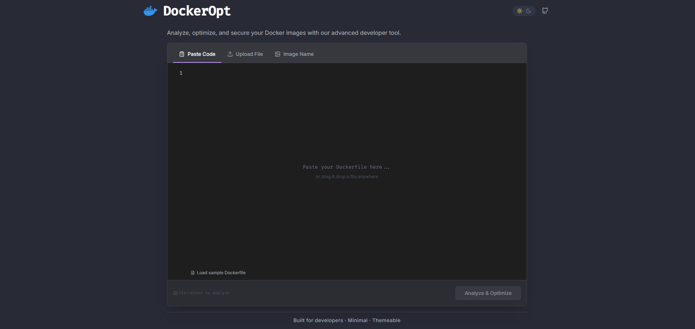

# DockerOpt


---

## 🚀 Introduction

**DockerOpt** is an AI-powered Dockerfile analyzer and optimizer. Instantly analyze your Dockerfiles for security, performance, and best practices. Paste, upload, or photograph your Dockerfile and get actionable suggestions and a refactored output.

<p align="center">
    
</p>

<!-- Optionally, add a demo GIF here -->
<!-- <p align="center">
    
</p> -->

---

---

## Features

- **Three Input Modes** — Paste, file upload, or image (OCR) input
- **Monaco Editor** — Syntax-highlighted Dockerfile editing with line numbers
- **AI Analysis** — GPT-powered scoring across security, performance, size, and best practices
- **Dashboard View** — Tabbed results with Overview, Issues, Optimizations, Size, Security, and Logs
- **Optimized Output** — Get a refactored Dockerfile ready to use
- **Dark / Light Theme** — Dracula-inspired dark mode with full light theme support
- **Keyboard Shortcuts** — `Ctrl+Enter` to analyze instantly
- **Drag & Drop** — Drop `.dockerfile` or text files anywhere on the page
- **Responsive** — Mobile-first design with hamburger nav and adaptive layout
- **Latency Tracking** — Real-time API response time indicator

---

## Tech Stack

| Layer | Tech |
|-------|------|
| Framework | React 18 + TypeScript |
| Build | Vite |
| Styling | Tailwind CSS (Dracula palette) |
| Editor | Monaco Editor (`@monaco-editor/react`) |
| AI | OpenAI SDK (GPT via KodeKloud API) |
| Charts | Chart.js + react-chartjs-2 |
| Icons | lucide-react |
| Notifications | react-hot-toast |

---

## Getting Started

```bash

## Getting Started

```bash
# Clone
git clone https://github.com/pardeep1916P/DockerOpt.git
cd DockerOpt


# Install dependencies
npm install

# Create .env file
cp .env.example .env
# Add your API key and config to .env

# Run dev server
npm run dev
```

### Environment Variables

Create a `.env` file in the root:

```env
VITE_OPENAI_API_KEY=your_api_key
VITE_OPENAI_BASE_URL=https://api.ai.kodekloud.com/v1
VITE_OPENAI_MODEL=gpt-5.2

```

---


---

## 🛠️ How it Works

1. **Input**: Paste, upload, or photograph your Dockerfile.
2. **AI Analysis**: The app sends your Dockerfile to an OpenAI-powered API for multi-dimensional analysis (security, performance, size, best practices).
3. **Dashboard**: Results are displayed in a tabbed dashboard with scores, issues, and suggestions.
4. **Optimized Output**: Get a refactored Dockerfile and download or copy it instantly.

---

## Project Structure

```
src/
├── App.tsx                  # Main app with state & analysis flow
├── main.tsx                 # Entry point with ThemeProvider
├── index.css                # Global styles & Dracula theme
├── components/
│   ├── landing/
│   │   ├── Header.tsx       # Docker logo, nav, theme toggle
│   │   ├── LandingPage.tsx  # Hero section wrapper
│   │   └── InputSection.tsx # Editor, upload, image input tabs
│   ├── dashboard/
│   │   ├── Dashboard.tsx    # Analysis results layout
│   │   ├── Sidebar.tsx      # Tab navigation
│   │   └── tabs/            # Overview, Issues, Optimization, Size, Security, Logs
│   └── common/
│       ├── MetricCard.tsx   # Score display card
│       ├── ScoreRing.tsx    # Circular score indicator
│       └── SeverityBadge.tsx
├── context/
│   └── ThemeContext.tsx      # Dark/light theme provider
├── constants/
│   └── samples.ts           # Sample Dockerfile for testing
├── types/
│   └── index.ts             # TypeScript interfaces
└── utils/
    ├── openai.ts            # AI client & analysis prompt
    └── clipboard.ts         # Copy-to-clipboard utility
```

---


<!-- ## Landing Page


The DockerOpt landing page provides a modern, minimal, and themeable interface for analyzing, optimizing, and securing Docker images. Key features include:

- **Branding:** Prominent DockerOpt logo and name at the top.
- **Theme Toggle:** Easily switch between light and dark modes.
- **Code Editor:** Paste, upload, or drag-and-drop your Dockerfile for instant analysis. The editor supports tabs for different input methods (Paste Code, Upload File, Image Name).
- **Sample Loader:** Quickly load a sample Dockerfile for demonstration or testing.
- **Performance Indicator:** Displays analysis response time.
- **Analyze & Optimize Button:** Initiates the optimization process (disabled until input is provided).
- **Footer:** Highlights that the tool is built for developers, is minimal, and themeable.

The UI is designed for a seamless developer experience, focusing on usability and clarity.

--- -->

---

## 🤝 Contributing

Contributions, issues, and feature requests are welcome!

1. Fork the repository
2. Create your feature branch (`git checkout -b feature/YourFeature`)
3. Commit your changes (`git commit -m 'Add some feature'`)
4. Push to the branch (`git push origin feature/YourFeature`)
5. Open a Pull Request

---

## 📬 Contact & Support

- **Author:** [Pardeep Kumar](https://github.com/pardeep1916P)
- **Issues:** [GitHub Issues](https://github.com/pardeep1916P/DockerOpt/issues)
- **Discussions:** [GitHub Discussions](https://github.com/pardeep1916P/DockerOpt/discussions)

---

## ⚠️ Privacy & API Note

This app uses the [KodeKloud AI API](https://api.ai.kodekloud.com/v1) to analyze Dockerfiles. Your Dockerfile content is sent to a third-party service for analysis. Do not upload sensitive or proprietary information.

---

## License

MIT
