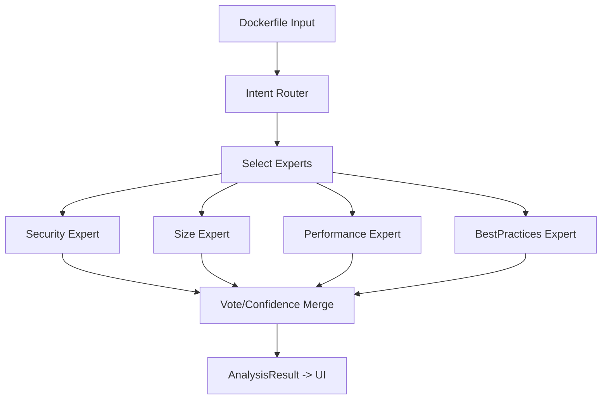

## Current state (what we’ll replace)

- `src/utils/openai.ts` calls exactly one model (`import.meta.env.VITE_OPENAI_MODEL`) with a single strict system prompt and expects a single JSON result.
- The UI (`src/App.tsx`) only consumes one `AnalysisResult` and renders sizes, issues, optimized Dockerfile, and security/vulnerabilities from that single response.
- `sample/test.md` contains previous single-model accuracy numbers (size estimation only) using ground-truth image sizes from Docker builds.

## Target architecture (multi-model expert system)

### 1) Router / orchestration layer

- Add a routing step that classifies the Dockerfile into an `intent` and selects a subset of experts.
- Router output shape (internal JSON):
  - `intent`: `security | size | performance | best_practices | mixed`
  - `experts`: an ordered list like `['size','security','best_practices','performance']`
  - `routerConfidence`: 0..1
- Router must fall back to calling all experts if confidence is low.

### 2) Specialized experts (agents)

- Implement 4 expert calls, each using the same base schema but with an expert-focused system prompt:
  - `SecurityExpert`: prioritize `vulnerabilitiesBefore` + security-related issues.
  - `SizeExpert`: prioritize `originalSize`, `optimizedSize`, `layerCount*`, `layersBefore/After`.
  - `PerformanceExpert`: prioritize optimization patterns (multi-stage, apt cleanup, caching), and estimate size impacts.
  - `BestPracticesExpert`: prioritize `optimizedDockerfile` and `changes` plus best-practices issues.
- Each expert response will include an extra internal field (e.g. `expertConfidence`) while still returning valid JSON parseable into the existing `AnalysisResult`.

### 3) Aggregation & ranking (voting + confidence)

- Build a deterministic merger that produces one `AnalysisResult` for the UI, by combining expert outputs:
  - Numeric fields (`originalSize`, `optimizedSize`, `optimizationScore`): confidence-weighted average or weighted median.
  - `optimizedDockerfile` + `changes`: pick the expert with highest `expertConfidence` (or best rule score) and accept its optimized output.
  - `issues` and `vulnerabilitiesBefore`: merge lists by key (`title` for issues, `cveId` for vulns), and prefer fields from higher-confidence experts.
  - `layersBefore/After`: vote by picking the most consistent expert output (highest overlap) or confidence-weighted merge.
  - `logs`: concatenate router + expert logs, so the UI’s `LogsTab` remains meaningful.

### 4) Shared context/memory (explicitly not in this upgrade)

- Keep it stateless beyond existing per-dockerfile caching.

## Implementation plan (file-level)

### Core runtime code

- Update `[src/utils/openai.ts](src/utils/openai.ts)`:
  - Keep the existing `analyzeDockerfile(dockerfile)` signature for the UI.
  - Internally change it to:
    1. call router,
    2. call selected experts (2-4 model calls depending on router output),
    3. merge into a single `AnalysisResult`.
  - Add an additional exported helper for testing/baselines:
    - `analyzeDockerfileWithModel(dockerfile, modelId)` (single-model mode for comparison).
  - Update caching to include router signature / mode (single vs multi) so cached results don’t cross-contaminate.
- Add new modules:
  - `[src/utils/multiModel/router.ts](src/utils/multiModel/router.ts)`
  - `[src/utils/multiModel/experts.ts](src/utils/multiModel/experts.ts)`
  - `[src/utils/multiModel/merge.ts](src/utils/multiModel/merge.ts)`
  - `[src/utils/multiModel/prompts.ts](src/utils/multiModel/prompts.ts)`
  - (optional) `[src/utils/multiModel/types.ts](src/utils/multiModel/types.ts)` for internal confidence/meta.

### Test + accuracy harness

- Add a script that:
  - reads each stack’s `Dockerfile` (non-optimal) and `Dockerfile.optimal` (optimal) from `sample/`.
  - builds each image (or reuses recorded ground truth if you want a no-docker mode), extracts built size in bytes.
  - runs:
    - single-model baselines (for the models listed in `sample/test.md`)
    - the new multi-model expert system
  - computes:
    - original size error dev % and optimized size error dev % (same formulas currently used in `sample/test.md`)
    - average error per model and final winner
  - updates `[sample/test.md](sample/test.md)` with an additional multi-model section and updated verdict.

## Data flow diagram

## How we ensure compatibility

- The final output of the merger must still conform to `AnalysisResult` in `[src/types/index.ts](src/types/index.ts)`.
- Expert and router internal fields (confidence/rationale) will be allowed to exist in the raw JSON, but the merger will only map the fields needed by `AnalysisResult`.

## Key risks / decisions we’ll implement defensively

- JSON robustness: keep prompts strict and add parsing guards so one expert failure doesn’t break the whole pipeline.
- Cost/latency: router should typically select 2 experts; if confidence is low, fall back to 4 experts.
- Model IDs: use an env var list of model IDs (`VITE_OPENAI_MODELS`) for expert model assignment; router model can default to one efficient model.

## Expected user-visible changes

- No UI redesign needed; only improved accuracy and better reliability for `optimizationScore`, size estimates, merged `issues`, and `optimizedDockerfile`.
- `sample/test.md` will include a new multi-model section and updated verdict comparing: single-model baselines vs multi-model expert system.

